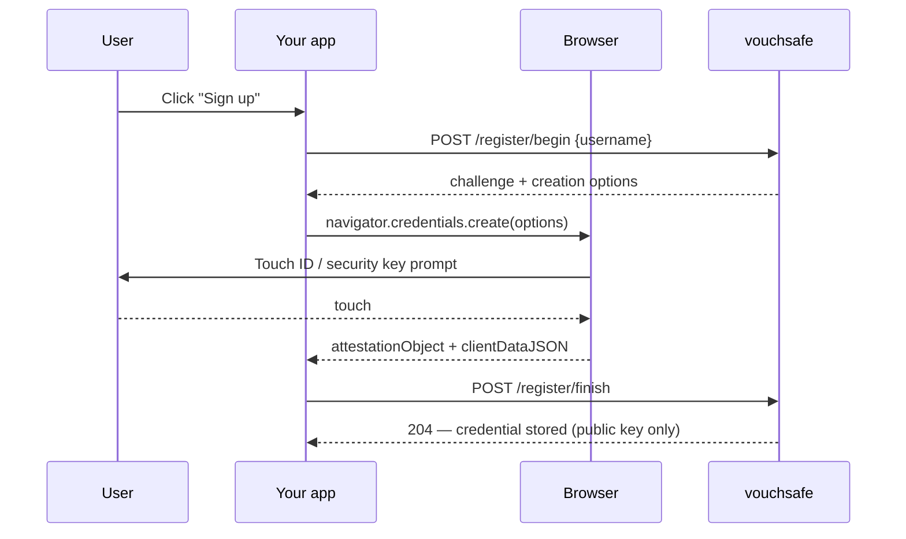
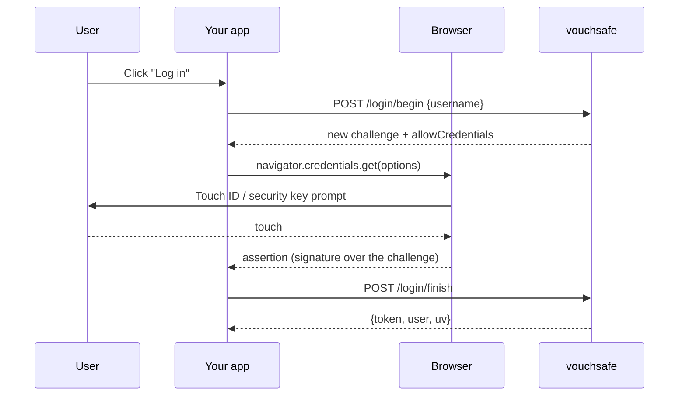

<p align="center">
  
</p>

<p align="center">
  
  
  
  
  
</p>

<p align="center"><b>Add passkey login to any application. One binary, no dependencies, no passwords stored — because there are none.</b></p>

<p align="center">
  <a href="#quick-start">Quick start</a> ·
  <a href="#demo">Demo</a> ·
  <a href="#how-it-works">How it works</a> ·
  <a href="#managing-credentials">Credentials API</a> ·
  <a href="#frozen-scope">Scope</a> ·
  <a href="#limits">Limits</a> ·
  <a href="STDLIB.md">STDLIB.md</a> ·
  <a href="BUILD.md">BUILD.md</a>
</p>

---

vouchsafe is a WebAuthn relying-party server: it lets an application replace passwords with fingerprint, face, or security-key login. It is **not** a password manager — it stores no secrets. Only public keys are kept, and the private key never leaves the authenticator's secure enclave. Steal the entire store file and you get nothing you can log in with.

Run the [Quick start](#quick-start) below — it's the fastest way to see it work: one build, one command, and a real passkey prompt in your browser within thirty seconds.

## Features

- **Passwordless login** — ES256, RS256, and EdDSA (Ed25519), verified correctly for each: ECDSA/RSA against a SHA-256 digest, EdDSA against the raw message (it hashes internally — a common and dangerous mistake is treating it like the other two)
- **Usernameless / discoverable login** — no username required at all; the browser offers every resident credential for the origin
- **Self-signed TLS** (`--tls`) — for demos on a non-loopback address, fingerprint printed at startup
- **Credential management** — list and revoke your own credentials over an authenticated API, with optional display nicknames
- **Per-ceremony UV policy override** — a single request can demand *stricter* verification than the server default, never weaker
- **`none` and `packed` attestation**, self- and full (`x5c`)
- **Zero dependencies** — `go.mod` has no `require` block; see [STDLIB.md](STDLIB.md) for what that replaced

## Quick start

```sh
go build ./cmd/vouchsafe
./vouchsafe serve
```

Open `http://localhost:8080/demo`, click Register, touch your sensor or security key. No certificate needed — browsers treat `localhost` as a secure context. For anything not on loopback, add `--tls` (see [Limits](#limits)).

No Go installed? Same result with just Docker:

```sh
docker build -t vouchsafe . && docker run --rm -p 8080:8080 vouchsafe
```

See [BUILD.md](BUILD.md#docker) for the full Docker workflow, including `docker build --target test` — builds, vets, runs all 253 tests, and runs the race detector (needs a C compiler; this way you don't need one installed anywhere).

## Demo

[`presentation/vouchsafe-neural-knights.pptx`](presentation/vouchsafe-neural-knights.pptx) — a thirteen-slide walkthrough covering the problem, the architecture, the security test suite, the numbers, and the honest limits.

For the real thing, running: [Quick start](#quick-start) below is three commands and thirty seconds on your own machine.

## How it works

Your application asks vouchsafe one question — *is this really user X?* — and gets back a cryptographically proven answer.





**Usernameless variant:** `POST /login/begin` with no `username` omits `allowCredentials` and returns a `flowId` instead — the browser shows every resident credential it holds for the origin, and the server reports back who logged in once the signature verifies. Identity is always resolved from *which credential signed*, never from anything the client claims (see `internal/ceremony`'s own doc comments on this — it's the one property this codebase is most paranoid about). The demo page's "Log in (usernameless)" button exercises this path.

## Managing credentials

Once logged in (holding the token from `/login/finish`), a caller can list or revoke their own credentials:

```
GET    /credentials              Authorization: Bearer <token>   -> [{id, algorithm, createdAt, aaguid, nickname}]
DELETE /credentials/{id}         Authorization: Bearer <token>   -> 204, or 404 if not found or not yours
```

Ownership is always resolved from the session token, never from anything in the URL or body — one user can't list or delete another's credential by guessing an ID. A registration can carry an optional `nickname` (e.g. `"Touch ID on MacBook"`) for display in this list; it's purely cosmetic and plays no part in any security decision.

A single ceremony can also request a *stricter* UV policy than the server's configured default by sending `"uv": "required"` in `/register/finish` or `/login/finish` — it can only tighten the floor, never loosen it (see `policy.EffectivePolicy`).

## Frozen scope

**Signature algorithms** — supported for both registration and login:

| Algorithm | Composition | Typical authenticator |
|---|---|---|
| ES256 | ECDSA P-256 + SHA-256 | Apple, Android platform authenticators |
| RS256 | RSASSA-PKCS1-v1.5 + SHA-256 | Windows Hello, most security keys |
| EdDSA | Ed25519, message signed directly (no pre-hash) | YubiKey 5 and similar |

**Attestation formats:**
- `none` — supported. What platform authenticators overwhelmingly return; most relying parties decline attestation for privacy reasons.
- `packed` — supported, both self-attestation (credential's own key signs the statement) and full attestation (a certificate in `x5c` signs it). The certificate is verified as a signer, not chained to a trust anchor — that needs the FIDO Metadata Service, a remote lookup that's permanently out of scope.
- Everything else (`tpm`, `android-key`, `android-safetynet`, `fido-u2f`, `apple`) — a named refusal, never a silent pass.

**Permanently out of scope:** FIDO Metadata Service lookups (needs a remote service), enterprise attestation, U2F/CTAP1 legacy compatibility, WebAuthn extensions beyond reading the ED flag, account recovery flows, a full user-management UI beyond credential list/revoke.

## Limits

- **Secure context required.** WebAuthn only works over HTTPS, or over plain HTTP on `localhost`/loopback. `--tls` generates a fresh self-signed certificate at startup and prints its SHA-256 fingerprint — meant for demos and judges reaching a non-loopback address, not for anything that needs a certificate trusted long-term. Without `--tls`, a non-loopback `--listen` address gets a startup warning instead.

> [!WARNING]
> **No real hardware authenticator has touched this code yet.** Every ceremony and the full negative-test suite (`tests/negative/`) are proven against a synthetic virtual-authenticator harness (`internal/webauthntest`), plus the compiled binary driven over real HTTP (`tests/e2e/`). The demo page's browser-side JavaScript has now also run in a real browser — Chromium, driven over Chrome DevTools Protocol's `WebAuthn` domain — exercising Register, Log in, and Log in (usernameless) end to end against the live server; that pass caught a real bug (registration wasn't requesting a discoverable credential, so usernameless login silently found nothing — fixed). What's still missing: an actual Touch ID, Windows Hello, or hardware security key. CDP's virtual authenticator is a software stand-in, not a fingerprint sensor or a secure enclave. Do a real-hardware pass across at least Safari/Touch ID, Edge/Windows Hello, and a hardware key before relying on this in front of anyone.

> [!NOTE]
> **Verification is fast; durability is what costs.** `go test -bench=. ./internal/ceremony/` shows raw signature verification at 26-62µs regardless of algorithm, but a full `Login()` call costs ~9ms — almost entirely the fsync'd atomic write `UpdateSignCount` performs on every login. That's the honest cost of a durable counter, not a slow verifier; see [BUILD.md](BUILD.md).

**Race detector: verified, zero data races.** `go test -race` needs a C compiler (Go's own cgo requirement — nothing here uses cgo). Confirmed clean across all 13 packages via `docker build --target test .` (see [BUILD.md](BUILD.md#race-detector) for that and the native-install path).

## Storage

`vouchsafe.json`, mode 0600 (POSIX systems), created atomically on every write. Holds public keys only — no passwords, no password hashes, no shared secrets.

## Prior art

Every Go WebAuthn library (`go-webauthn/webauthn`, `fxamacker/webauthn`, `duo-labs/webauthn`) depends on `fxamacker/cbor` — chosen, in the maintainers' own words, because it "doesn't crash" and is "the most well-tested CBOR library available," with 375+ tests and billions of fuzzing executions. Smaller pure-Go CBOR decoders exist too (`digitalbazaar/cbor`, `quartzjer/cb0r`) — all still third-party, so the zero-dependency rule forces a hand-written decoder regardless of which upstream option is being replaced. See [STDLIB.md](STDLIB.md) for the full substitution table and `tests/negative/` for the suite proving the replacement enforces every check the original does.

## License

MIT — see [LICENSE](LICENSE).

<p align="center"><sub>Steal <code>vouchsafe.json</code> and you get nothing you can log in with. There are no passwords here.</sub></p>
